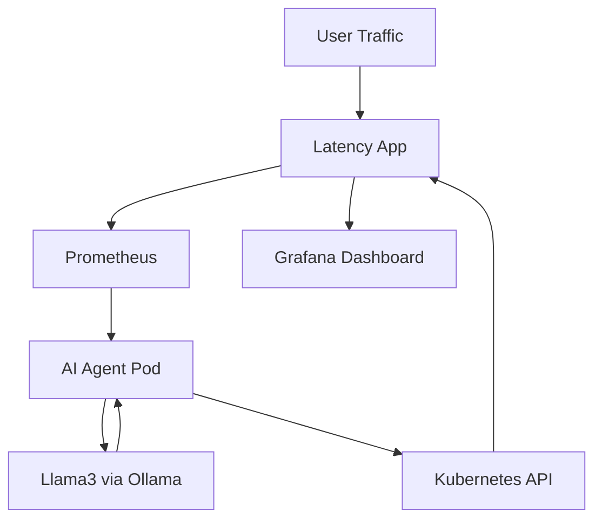

# 🚀 AI Latency Healing Agent for Kubernetes (Agentic AI + Prometheus + Grafana)


🚀 This project demonstrates an **AI-powered SRE agent** that:

👉 Detects **high latency (p95)** using Prometheus
👉 Uses **Llama3 (Ollama)** for decision-making
👉 Automatically **scales Kubernetes deployments**
👉 Shows impact in **Grafana dashboards**

---

# 🎯 Problem Statement

In real-world systems:

* CPU may look normal ❌
* But users experience **high latency** ❌

👉 Traditional scaling (CPU-based) fails

---

# 🧠 Solution

Build an **AI Agent** that:

* Monitors **latency (user experience)**
* Makes **intelligent scaling decisions**
* Automatically **heals performance issues**

---

# 🏗 Architecture (Mermaid)



---

# 🔄 Workflow

```text
1. User traffic increases
2. Latency (p95) rises
3. Prometheus collects metrics
4. AI agent queries Prometheus
5. Sends latency to Llama3
6. LLM decides action:
   - SCALE_DEPLOYMENT
   - DO_NOTHING
7. Agent scales deployment
8. Latency reduces
9. Grafana shows improvement
```

---

# 🛠 Tech Stack

| Component             | Purpose                 |
| --------------------- | ----------------------- |
| Kubernetes (Minikube) | Container orchestration |
| Prometheus            | Metrics collection      |
| Grafana               | Visualization           |
| Python                | AI agent                |
| Ollama                | Local LLM runtime       |
| Llama3                | Decision engine         |
| kube-prometheus-stack | Monitoring stack        |

---

# ⚡ Setup Instructions

---

# 🚀 1️⃣ Start Minikube

```bash
minikube start
```

---

# 🚀 2️⃣ Install Prometheus + Grafana

```bash
helm repo add prometheus-community https://prometheus-community.github.io/helm-charts
helm repo update

helm install monitoring prometheus-community/kube-prometheus-stack
```

---

# 🚀 3️⃣ Create Namespace

```bash
kubectl create namespace prod
```

---

# 🚀 4️⃣ Deploy Latency App

kubectl apply -f k8s/latency-app.yaml

# 🚀 5️⃣ Create Service

kubectl apply -f service.yaml

# 🚀 6️⃣ Add ServiceMonitor (IMPORTANT 🔥)

kubectl apply -f servicemonitor.yaml


# 🚀 7️⃣ Install dependencies
```bash
python3 -m venv .venv
source .venv/bin/activate
pip3 install kubernetes requests
```


# 🚀 8️⃣ Start AI Agent 

```bash
python3 agent.py
```


## 🔹 Step 1 — Normal State

* Pods: 2
* Latency: ~0.02

---

## 🔹 Step 2 — Generate Load

```bash
kubectl run load -n prod --rm -it --image=curlimages/curl -- sh
```

Inside:

```bash
while true; do
  for i in $(seq 1 200); do
    curl -s http://latency-app/delay/1 > /dev/null &
  done
  wait
done
```

---

# 🧠 Key Learning

* CPU ≠ User experience
* Latency is the real signal
* AI can automate SRE decisions
* Observability + AI = Autonomous systems

---

# ⭐ Support

If you found this useful:

* ⭐ Star this repo
* 🔔 Subscribe to YouTube
* 💬 Share feedback

---

# 👨‍💻 Author

DevOps Engineer building **AI-powered SRE systems**

---

# 📜 License

MIT License

---

```text
🚀 Part of "Agentic AI for DevOps" Series
```

